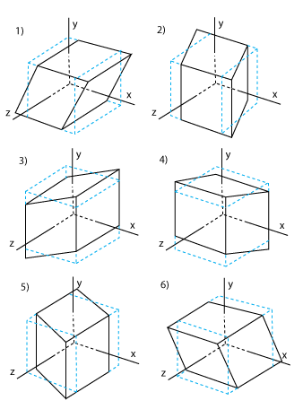

#3D Transformation ReadMe File
General Instructions:
* The maxium allowed nested read is 6. To change this setting, change the variable <numNested> in main.cpp somewhere below #include
* test cases are in "tests/" folder
* comment out "DEBUG = -DDEBUG" in Makefile can mute debug info

## Test Cases Specific To This Assignment in tests/ Folder

* stack.test

* perspective.test

* ortho.test

* lookat.test

* 3d-tests/

## Extra Features

* Orient
* Pause

## Findings for Orient
* a e i are for x, y, z scaling respectively. With only one of them set to 0, object will have 0 value in that axis. Setting more than 1 of them to zero will create error. Negative means scaling in the opposite side (e.g positive x scaling make a cube expand to the right while negative x scaling to the left )

* b c d g h i are for xy, xz, yz, yx, zx, zy shear respectively. 

Here take xy shear for example, it means z is not changed at all. In xy plane,  it shears horizontally as shown below (cannot be seen in markdown mode. Please view in raw text).

y 

|    _____
|   /    /
|  /____/ 
|___________x

likely, yx shear means it shears vertically.

y 
     /|
|   / |
|  | /
|  |/
|___________x

xz, zx, yz, zy shear are similar.
Please see picture 'shear' in the results/ folder for illustration:

1)-6) correspondes to xy,xz, yx, yz, zx, zy

